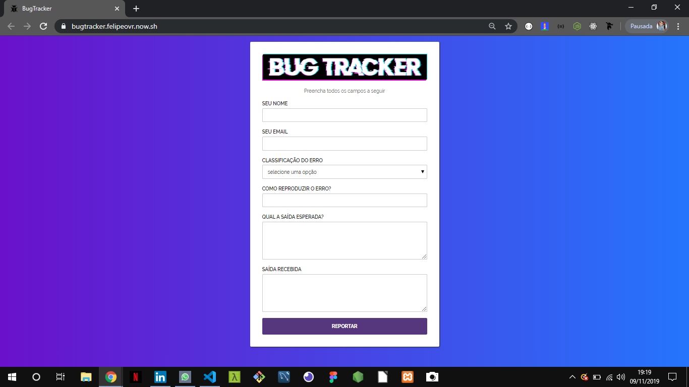
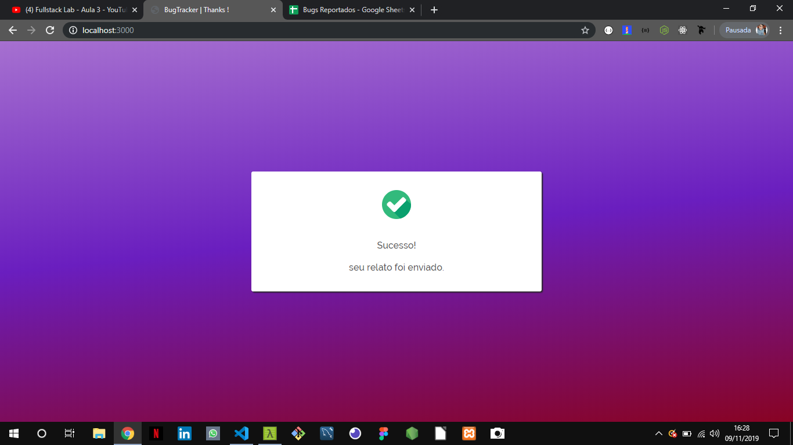

Projeto resultado do FullStack Lab Da [DevPleno](https://www.devpleno.com/)

# Sobre

Feito em Node, O projeto BugTracker tem como objetivo coletar de maneira simples e rápida, relatos de bugs em sistemas. Se encaixa perfeitamente em qualquer empresa que trabalhe com desenvolvimento de sistemas.

Os dados coletados no formulário, vão para uma planilha do google e graças a praticidade das ferramentas do google, a planilha pode ser facilmente compartilhada com pessoas que precisem ter acesso a essas informaçõe e solucionar o problema.

# Foram usados

* ejs
* google-spreadsheet API
* express
* sendgrid

#preview

Formulário de arrecadação de informações.
 
 
 

Aviso de que o relato foi enviado com sucesso.